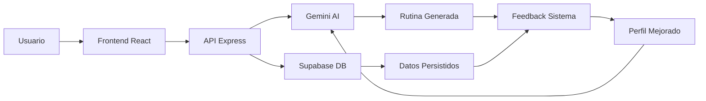

# 🏗️ FitnessPro - Análisis Arquitectónico Completo

## 📋 RESUMEN EJECUTIVO
**Proyecto:** FitnessPro (anteriormente Fitbro)
**Tipo:** Aplicación Full-Stack de Fitness con IA Avanzada
**Estado:** Funcional con sistemas de IA integrados
**Arquitectura:** Microservicios modulares con separación Frontend/Backend

## 🎯 STACK TECNOLÓGICO PRINCIPAL

### Frontend (React SPA)
- **React 18.3.1** + **TypeScript 5.6.3**
- **Vite 5.4.14** (Build tool y dev server)
- **Tailwind CSS 3.4.17** + **Shadcn/ui** (Design System)
- **Framer Motion 11.13.1** (Animaciones)
- **React Query 5.60.5** (Server state management)
- **React Hook Form 7.55.0** (Formularios)
- **Wouter 3.3.5** (Routing ligero)

### Backend (Node.js API)
- **Node.js** + **Express 4.21.2** + **TypeScript**
- **Supabase 2.49.8** (Base de datos PostgreSQL)
- **JWT + Passport.js** (Autenticación)
- **Multer 2.0.0** (Upload de archivos)
- **Drizzle ORM 0.39.1** (Database ORM)

### Servicios de IA
- **Google Gemini 2.0-flash** (Generación de rutinas y análisis nutricional)
- **Sistema de Feedback Inteligente** (Aprendizaje de preferencias)
- **Sistema Científico de Entrenamiento** (Splits y mesociclos)

## 🧠 SISTEMAS DE IA INTEGRADOS

### 1. Gemini AI Service (Núcleo Principal)
**Archivo:** `server/geminiService.ts`
**Funciones:**
- Generación de rutinas diarias personalizadas
- Análisis de imágenes de comida con visión artificial
- Sistema de traducción automática de ejercicios
- Adaptación basada en feedback del usuario
- Prompts científicos basados en Vince Gironda

### 2. Sistema de Feedback Inteligente
**Archivo:** `server/services/intelligentFeedbackService.ts`
**Funciones:**
- Consolidación de múltiples tipos de feedback
- Pesos temporales y por tipo de feedback
- Resolución de conflictos en preferencias
- Perfil consolidado con score de confianza
- Aprendizaje continuo de patrones del usuario

### 3. Sistema Científico de Entrenamiento
**Archivo:** `server/services/scientificWorkoutService.ts`
**Funciones:**
- Splits basados en principios científicos
- Sistema de recuperación muscular (48-72h)
- Mesociclos de 6-8 semanas con progresión automática
- Filtrado por limitaciones físicas del usuario

## 🏗️ ARQUITECTURA DE COMPONENTES

### Estructura Frontend
```
client/src/
├── components/
│   ├── ui/ (Shadcn/ui components)
│   ├── trainer/ (AI Trainer components)
│   ├── nutrition/ (Nutrition components)
│   ├── profile/ (Profile components)
│   └── [feature-components]
├── pages/ (Route components)
├── hooks/ (Custom hooks)
├── lib/ (Utilities y configuración)
├── contexts/ (React contexts)
└── i18n/ (Internacionalización)
```

### Estructura Backend
```
server/
├── routes/ (API endpoints)
├── services/ (Business logic)
├── middleware/ (Auth, logging, etc.)
├── utils/ (Utilities)
├── migrations/ (Database migrations)
└── [core-files]
```

## 🔄 FLUJOS DE DATOS PRINCIPALES

### 1. Generación de Rutinas con IA
```
Usuario → Preferencias → Gemini AI → Rutina Personalizada → Supabase → UI
```

### 2. Sistema de Feedback Inteligente
```
Feedback Usuario → Consolidación → Perfil Inteligente → Mejores Recomendaciones
```

### 3. Análisis Nutricional
```
Imagen Comida → Gemini Vision → Análisis Nutricional → Base de Datos → Dashboard
```

## 🛠️ HERRAMIENTAS Y FUNCIONALIDADES

### Herramientas de Fitness
1. **Generador de Rutinas Científicas**
2. **Sistema de Mesociclos (6-8 semanas)**
3. **Seguimiento de Progreso con Gráficos**
4. **Análisis Nutricional con IA**
5. **Sistema de Recuperación Muscular**
6. **Calendario de Entrenamientos**
7. **Feedback Inteligente Continuo**

### Herramientas de IA
1. **AI Trainer Chat** (Conversacional)
2. **Recomendaciones Personalizadas**
3. **Adaptación Automática de Rutinas**
4. **Análisis de Patrones de Usuario**
5. **Sistema de Limitaciones Físicas**

## 🔐 SEGURIDAD Y AUTENTICACIÓN

### Sistema de Autenticación
- **JWT Tokens** para sesiones
- **Bcrypt** para hash de passwords
- **Middleware de autenticación** en todas las rutas protegidas
- **Validación con Zod** en todos los endpoints

### Seguridad de Datos
- **Supabase RLS** (Row Level Security)
- **Validación de entrada** en frontend y backend
- **Sanitización de datos** antes de almacenamiento
- **CORS configurado** para producción

## 📊 BASE DE DATOS (Supabase)

### Tablas Principales
- **users** (Usuarios y perfiles)
- **workout_plans** (Planes de entrenamiento)
- **daily_workout_plans** (Rutinas diarias generadas)
- **workout_sessions** (Sesiones completadas)
- **meals** (Registro nutricional)
- **user_preferences** (Preferencias del usuario)
- **feedback_raw_data** (Feedback sin procesar)
- **user_feedback_profiles** (Perfiles consolidados)
- **scientific_splits** (Splits científicos)
- **workout_mesocycles** (Mesociclos de entrenamiento)

## 🎨 DISEÑO Y UX

### Design System
- **Shadcn/ui** como base de componentes
- **Tailwind CSS** para styling consistente
- **Framer Motion** para animaciones fluidas
- **Lucide React** para iconografía
- **Responsive Design** mobile-first

### Características UX
- **Interfaz intuitiva** con navegación clara
- **Feedback visual** en todas las acciones
- **Carga progresiva** de contenido
- **Modo oscuro/claro** disponible
- **Internacionalización** (i18n) preparada

## 🔄 INTEGRACIÓN Y COMPLEMENTARIEDAD

### Cómo se Complementan los Sistemas
1. **Gemini AI** genera rutinas → **Sistema Científico** valida splits → **Feedback Inteligente** aprende preferencias
2. **Supabase** almacena datos → **React Query** gestiona estado → **UI Components** muestran información
3. **Middleware** autentica → **Services** procesan lógica → **Storage** persiste datos
4. **Frontend** captura feedback → **Backend** consolida → **IA** mejora recomendaciones

### Flujo de Trabajo Integrado


## 🚀 CARACTERÍSTICAS AVANZADAS

### Sistema de Aprendizaje
- **Feedback continuo** del usuario
- **Adaptación automática** de rutinas
- **Detección de patrones** de entrenamiento
- **Mejora progresiva** de recomendaciones

### Funcionalidades Científicas
- **Principios de Vince Gironda** integrados
- **Recuperación muscular** basada en ciencia
- **Progresión automática** de mesociclos
- **Filtrado por limitaciones físicas**

### Tecnologías Emergentes
- **WebSocket** preparado para tiempo real
- **PWA capabilities** para instalación
- **Offline support** en desarrollo
- **Push notifications** implementadas

## 🎯 PROPÓSITO Y OBJETIVO DEL PROYECTO

### Misión Principal
FitnessPro es una **plataforma integral de fitness con IA** que combina:
- **Ciencia del ejercicio** moderna
- **Inteligencia artificial** avanzada
- **Experiencia de usuario** excepcional
- **Personalización** extrema

### Objetivos Específicos
1. **Democratizar el entrenamiento científico** - Hacer accesible el conocimiento avanzado
2. **Personalización inteligente** - Rutinas adaptadas a cada usuario
3. **Progresión sistemática** - Evitar estancamientos con mesociclos
4. **Educación continua** - Enseñar principios científicos
5. **Motivación sostenible** - Mantener adherencia a largo plazo

### Diferenciadores Clave
- **IA Gemini 2.0-flash** para generación de rutinas
- **Sistema científico** basado en Vince Gironda
- **Feedback inteligente** que aprende continuamente
- **Mesociclos automáticos** para progresión
- **Limitaciones físicas** respetadas automáticamente

## 📈 ANÁLISIS DE COMPLEMENTARIEDAD

### Cómo Funciona el Ecosistema
1. **Usuario ingresa** → **Preferencias capturadas** → **IA genera rutina**
2. **Usuario entrena** → **Feedback recolectado** → **Sistema aprende**
3. **Patrones detectados** → **Rutinas mejoradas** → **Mejor experiencia**
4. **Mesociclo completo** → **Cambio automático** → **Progresión continua**

### Sinergia Entre Componentes
- **Frontend React** + **Backend Express** = Experiencia fluida
- **Gemini AI** + **Sistema Científico** = Rutinas inteligentes y seguras
- **Supabase** + **React Query** = Datos sincronizados en tiempo real
- **Feedback System** + **Learning AI** = Personalización que mejora

### Integración Tecnológica
```
Datos Usuario → Gemini AI → Rutina Generada → Validación Científica →
Feedback Capturado → Perfil Consolidado → Mejores Recomendaciones
```

## 🔍 CONCLUSIONES DEL ANÁLISIS

### Fortalezas Arquitectónicas
1. **Modularidad** - Componentes independientes y reutilizables
2. **Escalabilidad** - Arquitectura preparada para crecimiento
3. **Mantenibilidad** - Código organizado y documentado
4. **Seguridad** - Autenticación robusta y validaciones
5. **Performance** - Optimizaciones en frontend y backend

### Innovaciones Técnicas
1. **IA Conversacional** para entrenamiento personalizado
2. **Sistema de Mesociclos** automático y científico
3. **Feedback Inteligente** con consolidación de preferencias
4. **Limitaciones Físicas** respetadas por IA
5. **Progresión Automática** sin intervención manual

### Impacto en el Usuario
- **Experiencia personalizada** desde el primer día
- **Rutinas seguras** que respetan limitaciones
- **Progresión garantizada** con cambios automáticos
- **Educación continua** sobre principios científicos
- **Motivación sostenida** con variedad inteligente
