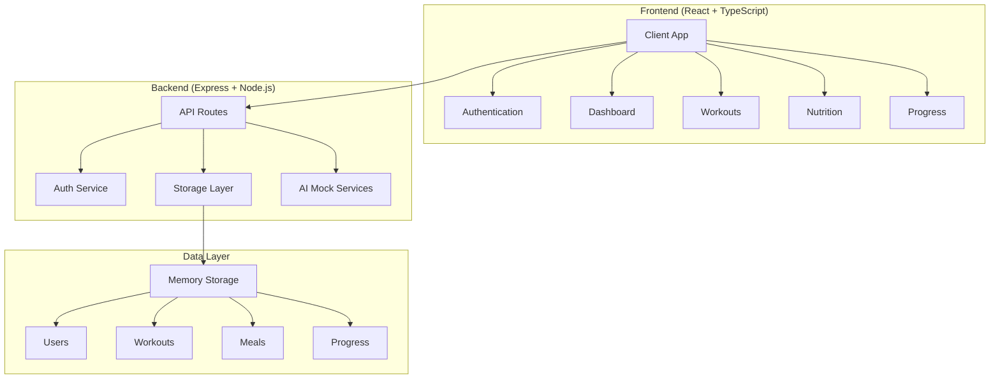

# 📋 Project Brief - Fitbro

## 🎯 Proyecto Overview
**Nombre:** Fitbro
**Tipo:** Aplicación web de fitness
**Estado:** ✅ Completado e Inicializado
**Fecha de Inicio:** Enero 2025
**Última Actualización:** Enero 2025

## 🎪 Alcance del Proyecto
Desarrollo completo de una aplicación web de fitness inspirada en Fitbro, que incluye:
- Planes de entrenamiento personalizados
- Análisis nutricional con fotos
- Seguimiento de progreso en tiempo real
- Dashboard interactivo
- Sistema de autenticación JWT

## 🎯 Objetivos Principales
1. ✅ **Análisis Completo** - Entender la estructura y propósito del proyecto
2. ✅ **Corrección de Errores** - Resolver problemas de TypeScript y compatibilidad
3. ✅ **Inicialización** - Poner la aplicación en funcionamiento
4. ✅ **Rebranding** - Cambiar de "Fitbud AI" a "Fitbro"
5. ✅ **Documentación** - Crear Memory Bank completo

## 📁 Índice del Memory Bank

### 📊 Archivos Principales
- **productContext.md** - Contexto del producto y experiencia de usuario
- **systemPatterns.md** - Arquitectura, patrones y diagramas del sistema
- **techContext.md** - Stack tecnológico, dependencias y configuraciones
- **activeContext.md** - Estado actual, cambios recientes y enfoque

### 📈 Seguimiento y Control
- **progress.md** - Progreso completado y funcionalidades implementadas
- **errorTracking.md** - Errores encontrados, análisis y soluciones
- **pendingTasks.md** - Tareas pendientes organizadas por prioridad
- **suggestions.md** - Sugerencias de mejoras y próximos pasos

## 🏗️ Arquitectura de Alto Nivel

## 🎯 Funcionalidades Core
1. **Autenticación** - JWT + bcrypt
2. **Planes de Entrenamiento** - Generación automática basada en perfil
3. **Nutrición** - Registro manual + análisis de fotos (mock)
4. **Progreso** - Tracking de peso, medidas y logros
5. **Dashboard** - Estadísticas en tiempo real

## 📊 Métricas del Proyecto
- **Archivos de Código:** ~50+ archivos
- **Líneas de Código:** ~5000+ líneas
- **Componentes React:** 15+ componentes
- **Rutas API:** 20+ endpoints
- **Dependencias:** 80+ paquetes npm

## 🎨 Stack Tecnológico Resumen
- **Frontend:** React 18 + TypeScript + Vite + TailwindCSS
- **Backend:** Node.js + Express + TypeScript
- **Base de Datos:** Memory Storage (configurado para PostgreSQL)
- **Autenticación:** JWT + bcrypt
- **UI Components:** Radix UI + shadcn/ui
- **Estado:** TanStack Query
- **Routing:** Wouter

## 🚀 Estado Actual
- ✅ Aplicación completamente funcional
- ✅ Ejecutándose en http://localhost:5000
- ✅ Todos los errores de TypeScript resueltos
- ✅ Rebranding completado (Fitbud AI → Fitbro)
- ✅ Documentación técnica creada

## 🚀 NUEVA FASE: ENTRENADOR AI COMPLETO
**Estado**: 🔄 EN DESARROLLO ACTIVO
**Fecha Inicio**: Enero 2025
**Objetivo**: Implementar entrenador personal AI que reemplace tab Progress con chat inteligente

### 🎯 Características del Entrenador AI:
- ✅ Configuración personalizada (nombre, género, tono de interacción)
- ✅ Chat inteligente con Gemini AI
- ✅ Lectura completa de datos del usuario
- ✅ Actualización automática de base de datos
- ✅ Memoria conversacional entre sesiones
- ✅ Diario emocional automático
- ✅ Tests de condición física dinámicos

## 🔮 Próximos Pasos Sugeridos
1. **Base de Datos Real** - Migrar de memory storage a PostgreSQL
2. **APIs Externas** - Integrar Google Cloud Vision para análisis de fotos
3. **Testing** - Implementar tests unitarios y de integración
4. **Deployment** - Configurar CI/CD y deployment
5. **Mobile App** - Considerar aplicación móvil nativa

---
**Última Actualización:** Enero 2025
**Responsable:** Colin (Ingeniero de Sistemas)
**Estado del Memory Bank:** 🟢 Activo y Actualizado
