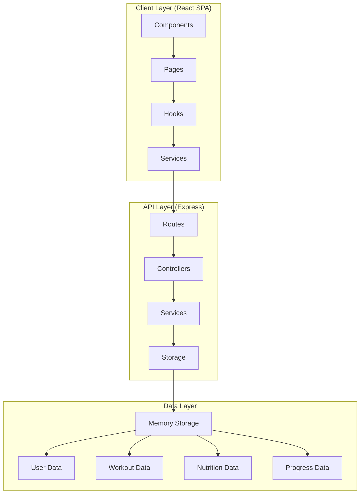

# 🏗️ System Patterns - Fitbro

## 🎯 Arquitectura General

### **Patrón Arquitectónico Principal: MVC + API-First**



## 🔧 Patrones de Diseño Implementados

### **1. Repository Pattern (Storage Layer)**
```typescript
// Abstracción para operaciones de datos
interface IStorage {
  getUser(id: number): Promise<User | undefined>;
  createUser(user: InsertUser): Promise<User>;
  // ... más métodos
}

class MemStorage implements IStorage {
  // Implementación en memoria
}
```

### **2. Service Layer Pattern (API)**
```typescript
// Separación de lógica de negocio
const generateWorkoutPlan = (userId, level, goal) => {
  // Lógica de generación de planes
};

const analyzeFoodImage = async (imageBuffer) => {
  // Lógica de análisis de imágenes
};
```

### **3. Custom Hooks Pattern (React)**
```typescript
// Encapsulación de lógica de estado
const useAuth = () => {
  // Lógica de autenticación
};

const useToast = () => {
  // Lógica de notificaciones
};
```

### **4. Compound Component Pattern (UI)**
```typescript
// Componentes composables
<Card>
  <CardHeader>
    <CardTitle>Title</CardTitle>
  </CardHeader>
  <CardContent>Content</CardContent>
</Card>
```

## 🏛️ Arquitectura Frontend

### **Estructura de Componentes**
```
client/src/
├── components/          # Componentes reutilizables
│   ├── ui/             # Componentes base (Radix UI)
│   ├── navigation.tsx  # Navegación principal
│   ├── floating-action-button.tsx
│   └── ...
├── pages/              # Páginas de la aplicación
│   ├── dashboard.tsx   # Dashboard principal
│   ├── workouts.tsx    # Gestión de entrenamientos
│   ├── nutrition.tsx   # Tracking nutricional
│   └── progress.tsx    # Seguimiento de progreso
├── hooks/              # Custom hooks
│   ├── use-auth.tsx    # Autenticación
│   └── use-toast.tsx   # Notificaciones
└── lib/                # Utilidades y configuración
    ├── auth.ts         # Servicio de autenticación
    └── queryClient.ts  # Cliente de queries
```

### **Patrón de Estado: Server State + Local State**
- **TanStack Query** para estado del servidor
- **React State** para estado local de componentes
- **Context API** para estado global (auth)

## 🔧 Arquitectura Backend

### **Estructura API RESTful**
```
server/
├── index.ts           # Servidor principal
├── routes.ts          # Definición de rutas
├── storage.ts         # Capa de almacenamiento
└── vite.ts           # Configuración de desarrollo
```

### **Patrón de Rutas**
```typescript
// Agrupación por funcionalidad
/api/auth/*           // Autenticación
/api/user/*           // Gestión de usuarios
/api/workouts/*       // Planes de entrenamiento
/api/nutrition/*      // Análisis nutricional
/api/progress/*       // Seguimiento de progreso
/api/dashboard/*      // Estadísticas
```

### **Middleware Pattern**
```typescript
// Autenticación como middleware
const authenticateToken = (req, res, next) => {
  // Validación de JWT
};

app.get('/api/protected', authenticateToken, handler);
```

## 🗄️ Patrones de Datos

### **Schema-First Design**
```typescript
// Esquemas centralizados en /shared
export const users = pgTable("users", {
  id: serial("id").primaryKey(),
  username: text("username").notNull().unique(),
  // ... más campos
});

// Validación con Zod
export const loginSchema = z.object({
  username: z.string().min(1),
  password: z.string().min(1),
});
```

### **Type Safety End-to-End**
- **Shared Types** entre frontend y backend
- **Zod Schemas** para validación
- **TypeScript** para type safety

## 🎨 Patrones de UI/UX

### **Design System Pattern**
```typescript
// Componentes base consistentes
const Button = ({ variant, size, ...props }) => {
  return (
    <button 
      className={cn(buttonVariants({ variant, size }))}
      {...props}
    />
  );
};
```

### **Responsive Design Pattern**
```css
/* Mobile-first approach */
.container {
  @apply px-4 sm:px-6 lg:px-8;
}

/* Breakpoints consistentes */
sm: 640px   /* Tablet */
md: 768px   /* Desktop pequeño */
lg: 1024px  /* Desktop */
xl: 1280px  /* Desktop grande */
```

### **Progressive Enhancement**
- Funcionalidad básica sin JavaScript
- Mejoras progresivas con interactividad
- Graceful degradation

## 🔐 Patrones de Seguridad

### **Authentication Pattern**
```typescript
// JWT + HTTP-only approach
const token = jwt.sign({ userId, username }, JWT_SECRET);
localStorage.setItem('authToken', token);

// Middleware de autenticación
const authHeader = req.headers['authorization'];
const token = authHeader?.split(' ')[1];
```

### **Input Validation Pattern**
```typescript
// Validación en múltiples capas
1. Frontend: React Hook Form + Zod
2. Backend: Zod schemas
3. Database: Drizzle constraints
```

## 📊 Patrones de Performance

### **Code Splitting**
```typescript
// Lazy loading de páginas
const Dashboard = lazy(() => import('@/pages/dashboard'));
const Workouts = lazy(() => import('@/pages/workouts'));
```

### **Caching Strategy**
```typescript
// TanStack Query caching
const { data } = useQuery({
  queryKey: ['/api/user/profile'],
  staleTime: Infinity,
  retry: false,
});
```

### **Bundle Optimization**
- **Vite** para desarrollo rápido
- **Tree shaking** automático
- **Asset optimization**

## 🔄 Patrones de Desarrollo

### **Hot Module Replacement**
- Desarrollo con recarga instantánea
- Preservación de estado durante desarrollo
- Feedback inmediato de cambios

### **Type-Driven Development**
1. Definir tipos/schemas primero
2. Implementar lógica basada en tipos
3. Validación automática en runtime

### **Component-Driven Development**
- Componentes aislados y reutilizables
- Storybook-ready (futuro)
- Testing por componente

## 🧪 Patrones de Testing (Futuro)

### **Testing Strategy**
```typescript
// Unit Tests: Componentes individuales
// Integration Tests: Flujos completos
// E2E Tests: User journeys

describe('Authentication', () => {
  it('should login successfully', () => {
    // Test implementation
  });
});
```

## 📈 Patrones de Escalabilidad

### **Modular Architecture**
- Separación clara de responsabilidades
- Bajo acoplamiento, alta cohesión
- Fácil extensión y mantenimiento

### **API Versioning (Futuro)**
```typescript
/api/v1/users
/api/v2/users  // Nuevas versiones sin romper compatibilidad
```

---
**Última Actualización:** Enero 2025  
**Responsable:** Colin (System Architect)  
**Estado:** 🟢 Documentado y Implementado
